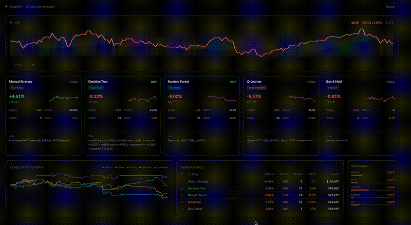

# Market Agent Arena

Five ML strategies compete on real JPM stock data (2008-2011): a rule-based manual strategy, a decision tree, a random forest, a Q-learner, and a buy-and-hold benchmark. Trained in-sample, tested out-of-sample.



**[Live Demo](https://market-agent-arena.vercel.app)** | **[Course Writeup](https://anthonyfeliz.com/blog/ml4t)**

## Strategies

- **Manual Strategy** — rule-based indicator thresholds (SMA distance, Bollinger %B, MACD)
- **Decision Tree** — correlation-based splits on 5 indicator features
- **Random Forest** — 15 bagged trees with bootstrap sampling
- **Q-Learner** — 216 discretized states, Bellman updates, exploit-only testing
- **Buy & Hold** — passive benchmark

## Technical Details

- Real JPM data from Georgia Tech CS 7646 ML4T course dataset
- 5 indicators: SMA distance, Bollinger Band %, MACD histogram, Stochastic %K, Rate of Change
- 65/35 train/test split with 52-bar indicator warmup
- Portfolio: $100K starting cash, $9.95 commissions, 0.1% market impact
- Sharpe ratio with Bessel's correction, annualized by sqrt(252)
- All training and simulation runs in a Web Worker off the main thread

## Stack

TypeScript, React, Vite, Tailwind CSS, Web Workers, Framer Motion

## Run locally

```bash
npm install
npm run dev
```
